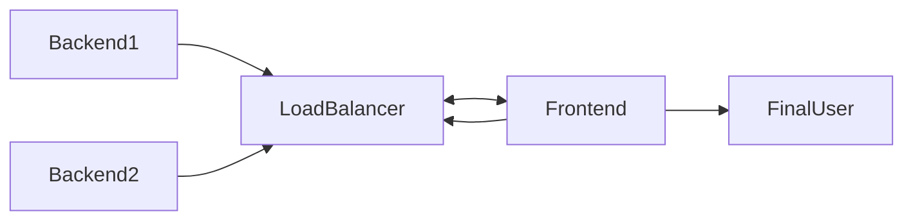

# euvic-recruitment-task
Welcome to my solution! I made a solution for a given task below:
> https://praca.euvic.pl/staz-2023-zadania-devops/
# How to launch
While being in the main folder use command:
```docker-compose up```
## Note! 
If you use localhost enviroment, you need to disable CORS in your web browser to see frontend and backend working.
# Folder Structure

|Folder| Purpose  |
|--|--|
| Backend1 | Golang web application |
|Backend2|Golang web application|
|Frontend|Folder with nginx container using frontend files|
|LoadBalancer|Folder with nginx container connecting both backends|
|docker-compose.yml|Docker compose file that binds the containers|


# How it works


