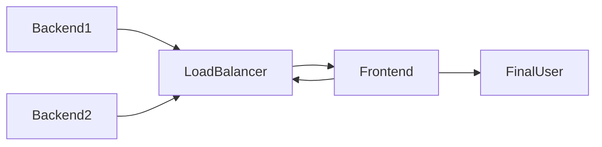

# euvic-recruitment-task
Welcome to my solution! I made a solution for a given task below:
> https://praca.euvic.pl/staz-2023-zadania-devops/
# How to launch
While being in the main folder use command:
```docker-compose up```
>**Note!** 
>If you use localhost enviroment, you need to disable CORS in your web browser to see frontend and backend working.

You can also pull each docker artifact from ghcr.io registry!
>**Note!**
>They are upgraded automatically with every new commit!
```
docker pull ghcr.io/swingyman/backend1:latest
docker pull ghcr.io/swingyman/backend2:latest
docker pull ghcr.io/swingyman/loadbalancer:latest
docker pull ghcr.io/swingyman/frontend:latest
```
# Folder Structure

|Folder| Purpose  |
|--|--|
| Backend1 | Golang web application |
|Backend2|Golang web application|
|Frontend|Folder with nginx container using frontend files|
|LoadBalancer|Folder with nginx container connecting both backends|
|docker-compose.yml|Docker compose file that binds the containers|


# How it works


Backend1 and Backend2 containers are isolated from outer network and can only be accessed via LoadBalancer container, which listens on 8080 port. 
LoadBalancer container picks random backend server to get response from. Frontend container listening on port 80 is sending requests to the LoadBalancer container and showing response as a final result.